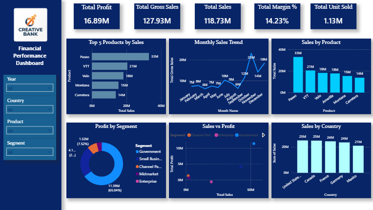

# 📊 Financial Performance Dashboard | Power BI

## 📌 Project Overview

This is my first Power BI dashboard project built using the Microsoft Financial Sample dataset.

The dashboard provides interactive insights into sales, profit, products, countries, and customer segments using Power BI.

---

## 🚀 Dashboard Features

- 📈 KPI Cards
  - Total Sales
  - Gross Sales
  - Total Profit
  - Profit Margin
  - Units Sold

- 📊 Interactive Visualizations
  - Monthly Sales Trend
  - Top 5 Products by Sales
  - Sales by Product
  - Sales by Country
  - Profit by Segment

- 🎛️ Interactive Slicers
  - Year
  - Country
  - Product
  - Segment

---

## 🛠 Tools Used

- Power BI Desktop
- Power Query
- DAX
- Microsoft Excel

---

## 📂 Dataset

- Microsoft Financial Sample (.xlsx)

---

## 📷 Dashboard Preview

> Add your dashboard screenshot below.

---

## 📈 Key Insights

- Paseo generated the highest sales.
- Government segment contributed the highest profit.
- Sales peaked in October.
- USA and Canada recorded the highest sales.

---

## 👩‍💻 Author

**Tanuja Hiremath**

Aspiring Data Analyst

### Skills

- SQL
- MySQL
- Power BI
- Python
- Excel

---

⭐ Thank you for visiting my project!
